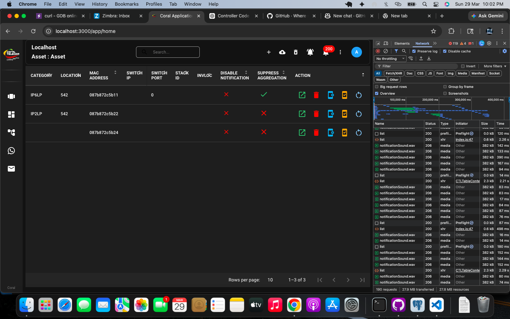

<p align="center">
  
</p>

<h1 align="center">EduMerge — Admission Management CRM</h1>

<p align="center">
  A full-stack admission management system built with <strong>Next.js 15</strong>, <strong>Go (Gin)</strong>, and <strong>MongoDB</strong>.<br/>
  Manage institutions, programs, seat quotas, applicants, and the complete admission lifecycle.
</p>

<p align="center">
  
  
  
  
  
  
</p>

---

## 📸 Dashboard Preview

<p align="center">
  
</p>

---

## 🌐 Live Demo

| Service | URL |
|---------|-----|
| 🖥️ **Frontend** | [https://admission-management-crm-2.onrender.com](https://admission-management-crm-2.onrender.com) |
| ⚙️ **Backend API** | [https://admission-management-crm-h8gq.onrender.com/api/v1](https://admission-management-crm-h8gq.onrender.com/api/v1) |
| 💚 **Health Check** | [https://admission-management-crm-h8gq.onrender.com/health](https://admission-management-crm-h8gq.onrender.com/health) |

> **Note:** Free-tier Render services sleep after 15 min of inactivity. First request may take ~30s.

### Demo Credentials

| Role | Email | Password |
|------|-------|----------|
| Admin | `admin@edumerge.com` | `Admin@123` |
| Admission Officer | `officer@edumerge.com` | `Officer@123` |
| Management | `management@edumerge.com` | `Mgmt@123` |

---

## 📋 Table of Contents

- [Dashboard Preview](#-dashboard-preview)
- [Live Demo](#-live-demo)
- [Features](#-features)
- [Architecture](#-architecture)
- [Tech Stack](#-tech-stack)
- [Getting Started](#-getting-started)
- [Environment Variables](#-environment-variables)
- [API Reference](#-api-reference)
- [Project Structure](#-project-structure)
- [Deployment](#-deployment)
- [Contributing](#-contributing)
- [License](#-license)

---

## ✨ Features

### 🏛️ Master Data Management
- **Institutions** — CRUD for affiliated universities
- **Campuses** — Multi-campus support per institution
- **Departments** — Academic departments per campus
- **Programs** — UG/PG programs with intake, duration, course type
- **Academic Years** — Configurable academic years with "current" toggle

### 💺 Seat Matrix & Quota Management
- **Quota-wise allocation** — KCET, COMEDK, Management quotas
- **Real-time atomic counters** — Instant seat fill/release
- **Supernumerary seats** — Additional category-based seats
- **Validation** — Quota totals must match program intake

### 👤 Applicant Management
- **Auto-generated IDs** — `APP/2026/0001` format
- **Comprehensive form** — 15+ fields (personal, academic, quota details)
- **Document checklist** — 7 standard documents (Pending → Submitted → Verified)
- **Fee tracking** — Pending / Paid / Partial / Waived

### 🎓 Admission Lifecycle
1. **Seat Allocation** → Validates quota availability, atomic seat decrement
2. **Fee Collection** → Update fee status on admission record
3. **Confirmation** → Generates admission number: `VTU/2026/UG/CSE/KCET/0001`
4. **Rollback** → Auto-rollback on allocation failure

### 📊 Analytics Dashboard
- **6 KPI cards** — Total Intake, Admitted, Remaining, Pending Docs, Pending Fees, Confirmed
- **Quota-wise bar chart** — Visual seat fill rate per quota
- **Program-wise pie chart** — Intake distribution across programs
- **Program summary table** — Fill rate percentages
- **Recent admissions feed**

### 🔐 Role-Based Access Control

| Feature | Admin | Officer | Management |
|---------|:-----:|:-------:|:----------:|
| Master Data CRUD | ✅ | ❌ | ❌ |
| Seat Matrix Config | ✅ | ❌ | ❌ |
| Create Applicant | ✅ | ✅ | ❌ |
| Allocate Seat | ✅ | ✅ | ❌ |
| Confirm Admission | ✅ | ✅ | ❌ |
| View Dashboard | ✅ | ✅ | ✅ |
| Manage Users | ✅ | ❌ | ❌ |

### 🎨 UI/UX
- 🌗 **Dark / Light / System** theme with smooth transitions
- 📱 **Fully responsive** — mobile & desktop
- 🧭 **Collapsible sidebar** with role-filtered navigation
- 💎 **Glass morphism** cards and gradient accents
- 🔔 **Toast notifications** via Sonner
- ✨ **Animated transitions** (fade-in, slide-in)

---

## 🏗 Architecture

```
┌─────────────────┐      HTTPS/JSON      ┌─────────────────┐      Driver      ┌───────────┐
│   Next.js 15    │ ◄──────────────────► │   Go (Gin)      │ ◄──────────────► │  MongoDB  │
│   React 19      │    Port 3000         │   REST API      │    Port 27017    │  Atlas    │
│   Tailwind v4   │                      │   JWT Auth      │                  │           │
└─────────────────┘                      └─────────────────┘                  └───────────┘
     Frontend                                Backend                           Database
```

**Backend — Clean Architecture:**

```
HTTP Request
    │
    ▼
┌──────────┐    ┌──────────┐    ┌──────────────┐    ┌─────────┐
│ Handlers │ →  │ Services │ →  │ Repositories │ →  │ MongoDB │
└──────────┘    └──────────┘    └──────────────┘    └─────────┘
    ▲                ▲                ▲
 Middleware       Models          Database
 (Auth/Log)
```

---

## 🛠 Tech Stack

| Layer | Technology |
|-------|-----------|
| **Frontend** | Next.js 15, React 19, TypeScript, Tailwind CSS v4 |
| **State Management** | Zustand |
| **HTTP Client** | Axios with JWT interceptors |
| **Charts** | Recharts |
| **Icons** | Lucide React |
| **Backend** | Go 1.22, Gin Framework, gin-contrib/cors |
| **Authentication** | JWT (golang-jwt/jwt/v5), bcrypt |
| **Database** | MongoDB 7, Official Go Driver |
| **DevOps** | Docker, Docker Compose, GitHub Actions CI/CD |
| **Deployment** | Render (render.yaml Blueprint) |
| **Security** | CSP headers, CORS, rate limiting, input sanitization |

---

## 🚀 Getting Started

### Prerequisites

| Tool | Version | Required |
|------|---------|----------|
| **Node.js** | ≥ 18 | ✅ |
| **Go** | ≥ 1.22 | ✅ |
| **MongoDB** | ≥ 7 | ✅ (or use Docker / Atlas) |
| **Docker** | Latest | Optional |

### Option 1 — Docker Compose (Recommended)

```bash
# 1. Clone the repository
git clone https://github.com/Rahulcse79/Admission_management_crm.git
cd Admission_management_crm

# 2. Create environment file
cp env.example.txt .env

# 3. Start all services (MongoDB + Backend + Frontend)
docker compose up --build
```

🎉 **That's it!** Open:
- **Frontend:** [http://localhost:3000](http://localhost:3000)
- **Backend API:** [http://localhost:8080/api/v1](http://localhost:8080/api/v1)
- **MongoDB:** `localhost:27017`

### Option 2 — Local Development

```bash
# 1. Clone & setup environment
git clone https://github.com/Rahulcse79/Admission_management_crm.git
cd Admission_management_crm
cp env.example.txt .env
# Edit .env with your MongoDB URI
```

**Start Backend:**
```bash
cd backend
go mod tidy
go run cmd/server/main.go
# ✅ Server running on http://localhost:8080
```

**Start Frontend (new terminal):**
```bash
cd frontend
npm install
npm run dev
# ✅ Frontend running on http://localhost:3000
```

### Option 3 — Make Targets

```bash
make dev          # Start backend + frontend concurrently
make build        # Build both services
make docker-up    # Docker compose up
make docker-down  # Docker compose down
make seed         # Seed demo data (all 3 user roles)
```

### First Login

1. Open [http://localhost:3000](http://localhost:3000)
2. Login with: **`admin@edumerge.com`** / **`Admin@123`**
3. The admin user is **auto-created** on first backend startup

---

## 🔐 Environment Variables

Create a `.env` file in the project root (see `env.example.txt`):

| Variable | Default | Description |
|----------|---------|-------------|
| `MONGODB_URI` | `mongodb://localhost:27017/admission_crm` | MongoDB connection string |
| `MONGODB_DATABASE` | `admission_crm` | Database name |
| `PORT` | `8080` | Backend server port |
| `GIN_MODE` | `debug` | Gin mode (`debug` / `release`) |
| `JWT_SECRET` | — | JWT signing secret (⚠️ change in production!) |
| `JWT_EXPIRY_HOURS` | `24` | JWT token expiry in hours |
| `CORS_ORIGINS` | `http://localhost:3000` | Allowed CORS origins (comma-separated) |
| `ADMIN_EMAIL` | `admin@edumerge.com` | Auto-seeded admin email |
| `ADMIN_PASSWORD` | `Admin@123` | Auto-seeded admin password |
| `ADMIN_NAME` | `System Admin` | Auto-seeded admin display name |
| `NEXT_PUBLIC_API_URL` | `http://localhost:8080/api/v1` | Frontend → Backend API URL |

---

## 📡 API Reference

All endpoints are prefixed with `/api/v1`

### Authentication
| Method | Endpoint | Auth | Description |
|--------|----------|:----:|-------------|
| `POST` | `/auth/login` | — | Login, returns JWT token |
| `POST` | `/auth/register` | Admin | Create new user |
| `GET` | `/auth/me` | ✅ | Get current user profile |
| `GET` | `/auth/users` | Admin | List all users |

### Master Data (Admin only for Create/Update/Delete)
| Method | Endpoint | Description |
|--------|----------|-------------|
| `GET` `POST` | `/institutions` | List / Create institutions |
| `GET` `PUT` `DELETE` | `/institutions/:id` | Read / Update / Delete |
| `GET` `POST` | `/campuses` | List (`?institution_id=`) / Create |
| `GET` `POST` | `/departments` | List (`?campus_id=`) / Create |
| `GET` `POST` | `/programs` | List (`?department_id=`) / Create |
| `GET` `POST` | `/academic-years` | List / Create |
| `PUT` | `/academic-years/:id/set-current` | Set active academic year |

### Seat Matrix
| Method | Endpoint | Auth | Description |
|--------|----------|:----:|-------------|
| `GET` `POST` | `/seat-matrices` | Admin | List / Create seat matrix |
| `GET` `PUT` | `/seat-matrices/:id` | Admin | Read / Update |
| `GET` | `/seat-matrices/availability` | ✅ | Check seat availability |

### Applicants
| Method | Endpoint | Auth | Description |
|--------|----------|:----:|-------------|
| `GET` | `/applicants` | ✅ | Paginated list (`?page=&limit=`) |
| `POST` | `/applicants` | Officer+ | Create new applicant |
| `GET` | `/applicants/:id` | ✅ | Get applicant details |
| `PUT` | `/applicants/:id/documents` | Officer+ | Update document status |
| `PUT` | `/applicants/:id/fee-status` | Officer+ | Update fee status |

### Admissions
| Method | Endpoint | Auth | Description |
|--------|----------|:----:|-------------|
| `GET` | `/admissions` | ✅ | List all admissions |
| `POST` | `/admissions/allocate` | Officer+ | Allocate seat to applicant |
| `PUT` | `/admissions/:id/confirm` | Officer+ | Confirm admission |
| `PUT` | `/admissions/:id/fee-status` | Officer+ | Update fee status |
| `GET` | `/admissions/:id` | ✅ | Get admission details |

### Dashboard
| Method | Endpoint | Description |
|--------|----------|-------------|
| `GET` | `/dashboard` | Aggregated KPI statistics |

---

## 📁 Project Structure

```
Admission_management_crm/
├── .github/
│   └── workflows/
│       └── ci-cd.yml              # GitHub Actions CI/CD pipeline
├── backend/
│   ├── Dockerfile                 # Multi-stage Go build
│   ├── go.mod / go.sum
│   ├── cmd/
│   │   ├── server/main.go        # 🚀 API entry point
│   │   └── seed/main.go          # 🌱 Seed demo data
│   └── internal/
│       ├── config/config.go      # Environment configuration
│       ├── database/mongodb.go   # MongoDB connection
│       ├── models/               # Domain models
│       ├── repository/           # Data access layer
│       ├── services/             # Business logic layer
│       ├── handlers/             # HTTP request handlers
│       ├── middleware/            # Auth & request logging
│       └── router/router.go     # Route definitions + CORS
├── frontend/
│   ├── Dockerfile                # Multi-stage Next.js build
│   ├── package.json
│   ├── next.config.ts            # Security headers + CSP
│   ├── app/
│   │   ├── layout.tsx            # Root layout + ThemeProvider
│   │   ├── page.tsx              # Auth redirect → /dashboard
│   │   ├── login/page.tsx        # Login page
│   │   └── dashboard/
│   │       ├── layout.tsx        # Sidebar + Header shell
│   │       ├── page.tsx          # 📊 Dashboard with KPIs & charts
│   │       ├── institutions/     # Institution management
│   │       ├── campuses/         # Campus management
│   │       ├── departments/      # Department management
│   │       ├── programs/         # Program management
│   │       ├── academic-years/   # Academic year config
│   │       ├── seat-matrix/      # Seat quota config
│   │       ├── applicants/       # Applicant list + form
│   │       ├── admissions/       # Admission lifecycle
│   │       └── users/            # User management
│   ├── components/               # Sidebar, Header, Theme, UI
│   └── lib/                      # API client, types, store, utils
├── docs/
│   └── dashboard-preview.png     # Dashboard screenshot
├── docker-compose.yml            # Full stack compose
├── render.yaml                   # Render Blueprint (auto-deploy)
├── Makefile                      # Dev shortcuts
└── env.example.txt               # Environment template
```

---

## 🚢 Deployment

### Deploy to Render (Production)

This project includes a `render.yaml` Blueprint for one-click deployment.

**Step 1 — Setup MongoDB Atlas (Free)**
1. Go to [mongodb.com/atlas](https://www.mongodb.com/atlas) → Create free cluster
2. Create a database user
3. Network Access → Allow `0.0.0.0/0`
4. Copy connection string

**Step 2 — Deploy Backend**
1. [Render Dashboard](https://dashboard.render.com) → **New Web Service**
2. Connect repo → `Rahulcse79/Admission_management_crm`
3. **Branch:** `main` · **Runtime:** Docker · **Dockerfile Path:** `./backend/Dockerfile`
4. Set environment variables (`MONGODB_URI`, `JWT_SECRET`, `CORS_ORIGINS`, etc.)
5. Health Check Path: `/health`

**Step 3 — Deploy Frontend**
1. New Web Service → Same repo
2. **Branch:** `main` · **Runtime:** Docker · **Dockerfile Path:** `./frontend/Dockerfile`
3. Set `NEXT_PUBLIC_API_URL` = `https://your-backend.onrender.com/api/v1`

**Step 4 — Update backend `CORS_ORIGINS`** with the frontend URL → Redeploy

### Deploy with Docker Compose

```bash
docker compose up --build -d     # Start in background
docker compose logs -f           # View logs
docker compose down              # Stop all services
```

---

## 🔄 CI/CD Pipeline

GitHub Actions runs on every push to `main`:

```
Push to main
    │
    ├── 🔧 Backend CI ──→ go vet → go test (race + coverage)
    │
    ├── 🎨 Frontend CI ──→ npm ci → eslint → next build
    │
    └── 🚀 Deploy ──→ Trigger Render deploy (backend + frontend)
```

---

## 🤝 Contributing

1. **Fork** the repository
2. **Create** a feature branch: `git checkout -b feature/amazing-feature`
3. **Commit** changes: `git commit -m 'feat: add amazing feature'`
4. **Push** to branch: `git push origin feature/amazing-feature`
5. **Open** a Pull Request

---

## 📄 License

MIT © [Rahul Singh](https://github.com/Rahulcse79)

---

<p align="center">
  Made with ❤️ using Next.js, Go & MongoDB
</p>
